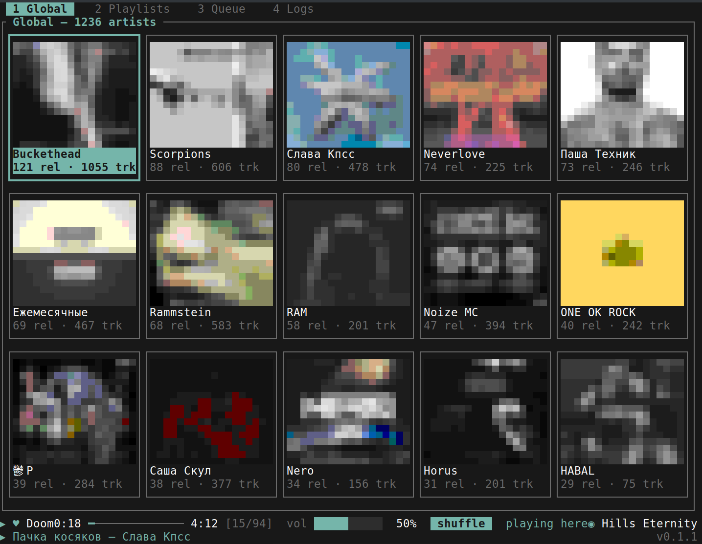

# furumi



**Your music. Your devices. Your network.**

Furumi is a federated P2P player for your personal music library. Every
running player is a complete, self-sufficient music library: it can import,
organize, search, and play your collection without an account, a cloud
backend, or a central service.

Connect Furumi on your desktop, laptop, or another device and they become one
personal music network. Playback, likes, playlists, and library state can move
between your devices, while missing tracks can be requested directly from
another player.

Furumi runs on **Linux, macOS, and Windows**.

## Why Furumi?

Music you own should not disappear because a subscription ended, a catalog
changed, a service was censored, or a server went offline.

Furumi is built around a different model:

- your library remains under your control;
- every player works independently;
- there is no central account or single point of failure;
- connecting more players improves availability instead of creating a new
  dependency;
- federation is optional and simple to configure.

A single Furumi instance is already useful. A group of instances becomes a
resilient network for your music.

## How it works

Each player maintains its own local library and publishes a searchable view of
it into Furumi's DHT network. Discovery does not depend on a central index.

Clients connect directly over P2P transport built on
[iroh](https://www.iroh.computer/). Furumi adds a synchronization protocol on
top of that transport to keep trusted devices consistent even when they are
not always online.

In practice:

1. Import music into any Furumi player.
2. Pair your other players or join a federation network.
3. Devices discover available libraries through the DHT.
4. Likes, playlists, playback state, and library metadata synchronize between
   trusted clients.
5. If a track is missing locally, Furumi can fetch it directly from another
   client.

There is no coordination server in the middle. Local players remain usable
when peers are offline, and the network becomes more capable as peers appear.

## The player

Furumi includes a full-featured terminal interface for browsing artists and
releases, searching, managing playlists and the queue, controlling playback,
inspecting connected devices, and configuring federation.

The interface supports keyboard-driven navigation, multi-key combinations,
context-aware bindings, and user-defined rebinding through TOML. Built-in
audio visualizations, OS media controls, gapless queue playback, and local
library management are included.

## Install

Download a prebuilt archive from the project releases, or build Furumi from
source with Rust 1.88 or newer:

```bash
cargo build --release --locked
./target/release/furumi
```

On Debian or Ubuntu, install the Linux audio build dependencies first:

```bash
sudo apt install libasound2-dev pkg-config
```

Equivalent ALSA development packages are required on other Linux
distributions. macOS and Windows require no additional system packages.

Import a music directory from Furumi's command line:

```text
:import /path/to/music
```

Federation, trusted-device pairing, and key bindings are configured directly
inside the player.

## Architecture

Furumi is a Rust application built with:

- `ratatui` and `crossterm` for the cross-platform TUI;
- `rodio` for local audio playback;
- SQLite for the personal library and synchronization state;
- a dedicated DHT for decentralized discovery;
- iroh-based P2P streams for client-to-client communication;
- an offline-tolerant operation log for trusted-device synchronization;
- Rhai for programmable audio visualizations.

More detail is available in [ARCHITECTURE.md](ARCHITECTURE.md).

## Contributing

Bug reports, design discussions, and patches are welcome. Before submitting a
change, run:

```bash
cargo fmt --all -- --check
cargo check --all-targets
cargo test --all-targets
```

## License

Furumi is released under the
[Do What The Fuck You Want To Public License, Version 2](LICENSE).
